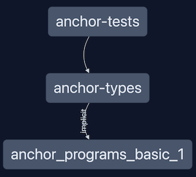

# Anchor

Folder setup using Anchor Framework. It contains programs, tests, and types. This proves NX can live alongside other frameworks, although I had to make some minor changes.

- `programs` folder can contain as many programs as you want. Each program has its own folder with a `project.json` file that helps Nx Monorepo to gain knowledge of the existence of this project, and therefore, leverage the power of Nx for running project's targets like `build`, `test`, `deploy` and `clean`. Also, it helps other projects to reference this project even if they are not importing any artefacts from it. e.g. The project `types` for storing the TS types generated by Anchor when building programs references the `programs` projects using `implicitDependencies` in the `project.json` file.
- `tests` folder contains all the tests for the programs. It is a separate Nx project from the programs because it is not a dependency of the programs, these tests run using mocha and chai, and they are not part of the build process of the programs. They are just a way to test the programs.
- `types` folder contains the TS types generated by Anchor when building programs. It is a separate Nx project from the programs because the idea behind it is to be able to import these types from other projects. e.g. The project `tests`.

Note: for adding the generated TS types we have to run a copy command after running the `anchor build` command. This is because the `anchor build` command does generate the TS types in the `target` folder. The `target` it is not commited to the repo. Using Nx we can do so or using Go-task, check the `project.json` file for more details, or the `Taskfile.yml` file.

## Deploy programs

NOTE: The following task are configured to run using `osascript` to open a terminal window (`iTerm2`). If you are not using MacOS, you can run the commands manually. Also, be sure you set up your Solana CLI, basically the URL and the keypair.

- Open a terminal front the root folder of the repository. Run `task anchor:localnet` to start the Solana cluster.
- Bild your programs. Each program folder has a `project.json` file that contains the `targets` that can be run. Using Go-task is also possible. Build and then Deploy.
